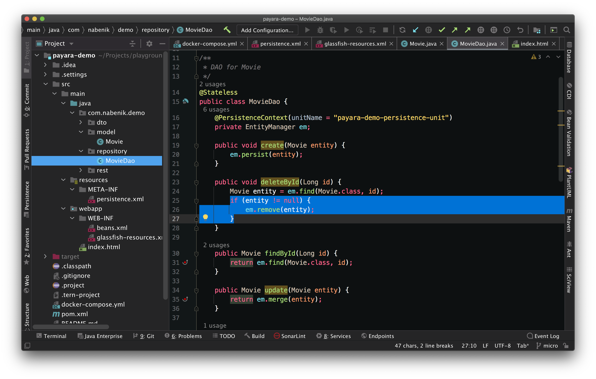

# Xndlnks Monocai Theme for IntelliJ

This is a dark high-contrast Monocai theme for IntelliJ.
It is inspired by [bmikaili](https://github.com/bmikaili/intellij-monocai-theme)
with some modifications and color fixes. This theme only works in IntelliJ 2019.1+.

## Preview

## Development

- Change colors in current IntelliJ instance
- Export scheme in Editor / Color Scheme to .icls file
- Copy XML entries in .icls file to `xndlnk_monocai.xml`

## Deployment

- Build/Prepare Plugin Module ... For Deployment
- Preferences / Plugins / Uninstall -> Restart
- Preferences / Plugins / Install plugin from disk / Select .jar file -> Apply
